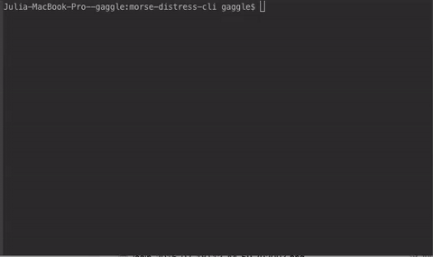

# morse-distress-cli
[](https://travis-ci.org/gaggle/morse-distress-cli)
[](https://coveralls.io/github/gaggle/morse-distress-cli?branch=master)
[](https://www.codacy.com/app/gaggle/morse-distress-cli?utm_source=github.com&amp;utm_medium=referral&amp;utm_content=gaggle/morse-distress-cli&amp;utm_campaign=Badge_Grade)

Military-grade cryptologic CLI to communicate securly with your homebase.
[It even works off-world](https://gist.github.com/kmckelvin/41a4a69e397b510274373aa241698561)!



```
$ bin/morse --help
Usage: bin/morse [text] [options]

Options:
--file, -f, -i, --input    Path to file containing text        [default: null]
--obfuscate, -o, --garble  Also obfuscate the text            [default: false]
--write, -w                Path to where output will be written[default: null]
-h, --help                 Show help                                 [boolean]

Examples:
bin/morse Laying an egg
bin/morse -f secrets.txt --obfuscate
```
